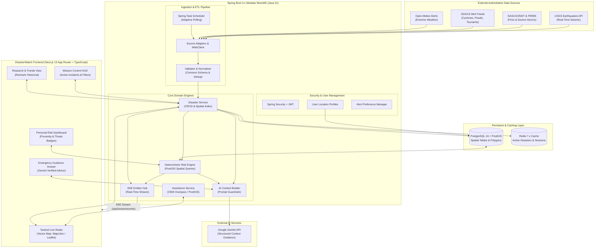
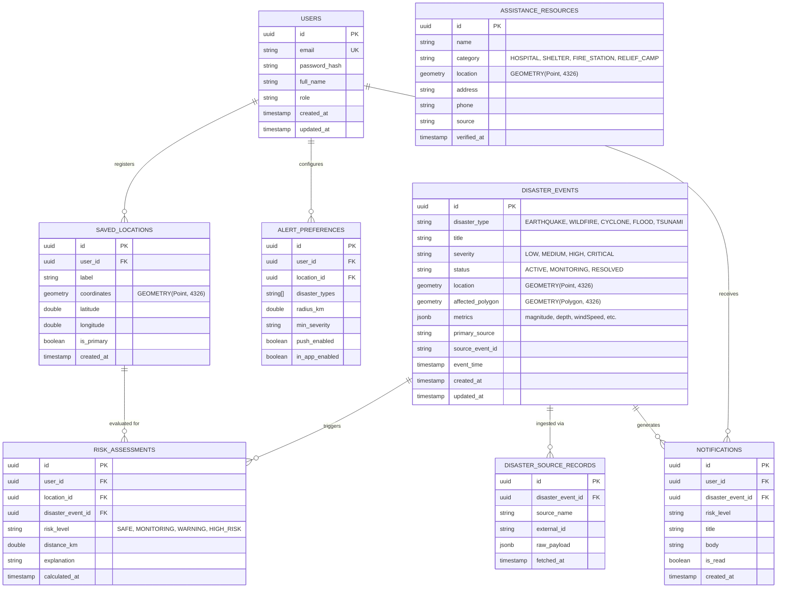

# DisasterWatch — System Architecture & Technical Specification

**System:** DisasterWatch  
**Architecture Pattern:** Modular Monolith (Clean Hexagonal Architecture)  
**Database Architecture:** Relational Spatial Store (PostgreSQL 16 + PostGIS)  
**Frontend Architecture:** Hybrid Web Application (Next.js 15 App Router + React + TypeScript)  
**Real-Time Protocol:** Server-Sent Events (SSE)  
**AI Integration:** Backend-Mediated Context Engine (Google Gemini 1.5/2.0 API)  

---

## 1. High-Level Architecture Diagram



---

## 2. End-to-End Operational Data Flow

```text
[1. Trigger]        Spring Scheduler fires cron job (e.g. Every 60s for USGS, 300s for NASA/GDACS).
                          │
[2. Ingest]         WebClient pulls GeoJSON/JSON payloads from external APIs asynchronously.
                          │
[3. Normalize]      Raw payloads parsed into unified internal model (DisasterEvent) with coordinates,
                    magnitude, category, severity, and event timestamp.
                          │
[4. Deduplicate]    Rule-based deduplication matches overlapping spatial coordinates (≤50km) and
                    timestamps (≤30min).
                          │
[5. Store & Cache]  Persisted to PostgreSQL using PostGIS GEOMETRY(Point, 4326) / Polygons.
                    Active disaster collection cached in Redis with 60s TTL.
                          │
[6. Risk Evaluate]  Deterministic PostGIS query: ST_DWithin and ST_Contains evaluate proximity to
                    all user-saved locations. Assigns: SAFE | MONITORING | WARNING | HIGH RISK.
                          │
[7. Realtime Push]  SSE Hub broadcasts payload to connected browser sessions instantly.
                          │
[8. AI Guidance]    When user selects an event or requests safety guidance, Backend Context Builder
                    supplies strictly verified facts to Google Gemini. Gemini generates structured,
                    safe, actionable instructions with emergency disclaimers.
```

---

## 3. Technology Stack Specification & Rationale

### 3.1 Frontend Stack

| Technology | Version | Purpose & Strategic Rationale |
|---|---|---|
| **Next.js** | `15.x` / `14.x` | Industry-standard React framework (App Router) enabling SSR for public alerts, static generation, built-in routing, and client-side map hydration. |
| **React** | `19.x` / `18.x` | Modern component-driven UI foundation with concurrent rendering. |
| **TypeScript** | `5.x` | Strict compile-time typing ensuring zero undefined property errors across complex GeoJSON payloads. |
| **Tailwind CSS** | `3.4.x` | Utility-first styling configured with custom tactical tokens (`surface-container`, `primary-cyan`, `secondary-crimson`). |
| **MapLibre GL JS / Leaflet** | `4.x` / `1.9.x` | High-performance open-source vector map rendering running purely client-side via `'use client'`. |
| **Zustand** | `4.5.x` | Lightweight, unopinionated client-side state management for active filters, selected incidents, and map viewports. |
| **TanStack Query (React Query)** | `5.x` | Asynchronous server-state management with automatic background refetching and caching. |
| **Recharts** | `2.12.x` | Monospace-compatible composable chart library for researcher analytics and historical trend views. |
| **Lucide React / Material Symbols** | Latest | Tactical, crisp SVG iconography for hazard domains and operational controls. |

### 3.2 Backend Stack

| Technology | Version | Purpose & Strategic Rationale |
|---|---|---|
| **Java** | `21 LTS` | Modern enterprise language offering Virtual Threads (Project Loom) for high-concurrency I/O and strong type safety. |
| **Spring Boot** | `3.2.x` | Production-grade backend framework providing dependency injection, data access, and declarative security. |
| **Spring Data JPA + Hibernate Spatial** | `3.2.x` | Seamless mapping between Java domain models and PostGIS geospatial database types (`org.locationtech.jts.geom.Point`). |
| **Spring Security + JWT** | `6.x` | Stateless, token-based authentication and role-based access control (`ROLE_USER`, `ROLE_RESEARCHER`, `ROLE_ADMIN`). |
| **Spring WebClient** | `3.2.x` | Non-blocking reactive HTTP client designed for parallel asynchronous ingestion from multiple international APIs. |
| **Spring Scheduler** | `3.2.x` | Cron and fixed-delay job scheduling with thread pooling for external source polling. |
| **Server-Sent Events (SSE)** | Native | Lightweight unidirectional real-time event streaming over standard HTTP; eliminates WebSocket handshake overhead for monitoring. |

### 3.3 Database & Spatial Infrastructure

| Technology | Version | Purpose & Strategic Rationale |
|---|---|---|
| **PostgreSQL** | `16.x` | Industry gold-standard ACID relational database. |
| **PostGIS Extension** | `3.4.x` | Spatial database extender enabling indexed distance queries (`ST_DWithin`), point-in-polygon checks (`ST_Contains`), and spatial bounding box queries. |
| **Redis** | `7.x` | High-throughput in-memory data store for caching active disaster list, rate limiting, and session blacklists. |

### 3.4 AI Integration Layer

| Technology | Model | Purpose & Strategic Rationale |
|---|---|---|
| **Google Gemini API** | `gemini-1.5-flash` / `gemini-1.5-pro` | Translates structured verified disaster context into human-readable safety briefs. Handled **strictly server-side** to protect API keys and constrain prompt output. |

---

## 4. Repository & Directory Structure

DisasterWatch adopts a structured **Monorepo** layout separating the React client, Spring Boot backend, infrastructure configs, and documentation:

```text
DisasterWatch/
├── .github/
│   └── workflows/
│       ├── frontend-ci.yml             # Build and test frontend
│       └── backend-ci.yml              # Maven build and JUnit spatial tests
│
├── frontend/                           # React + TypeScript + Vite Client
│   ├── public/
│   │   ├── favicon.ico
│   │   └── sounds/                     # Subtle tactical alert audio chimes
│   ├── src/
│   │   ├── assets/                     # Logos, static vector SVGs
│   │   ├── components/                 # Atomic UI primitives
│   │   │   ├── common/                 # Buttons, Badges, Modals, Loaders
│   │   │   ├── layout/                 # Tactical Header, Sidebar Nav, HUD Overlays
│   │   │   └── map/                    # MapLibre/Leaflet canvas, Markers, Beacons
│   │   ├── features/                   # Domain-driven feature modules
│   │   │   ├── disasters/              # Incident list, Filter pills, Telemetry card
│   │   │   ├── risk/                   # User risk meter, Location cards, Hazard HUD
│   │   │   ├── ai-assistant/           # Gemini guidance drawer, Checklist generator
│   │   │   ├── assistance/             # Nearby hospitals, shelters, route links
│   │   │   └── analytics/              # Recharts trends, severity distributions
│   │   ├── hooks/                      # Custom React hooks (useSSE, useGeolocation)
│   │   ├── services/                   # Axios/Fetch API client wrappers
│   │   ├── store/                      # Zustand state stores (incidentStore, filterStore)
│   │   ├── types/                      # TypeScript schemas & GeoJSON types
│   │   ├── styles/                     # Tailwind custom design tokens & animations
│   │   ├── App.tsx                     # Primary route coordinator
│   │   └── main.tsx                    # Application entry point
│   ├── index.html                      # HTML5 shell with Google Fonts
│   ├── package.json
│   ├── tailwind.config.js              # Stitch Tactical color palette config
│   ├── tsconfig.json
│   └── vite.config.ts
│
├── backend/                            # Spring Boot 3.x Application
│   ├── src/
│   │   ├── main/
│   │   │   ├── java/com/disasterwatch/
│   │   │   │   ├── DisasterWatchApplication.java
│   │   │   │   ├── common/             # Global exceptions, Base entities, Constants
│   │   │   │   ├── config/             # SecurityConfig, RedisConfig, PostGisConfig
│   │   │   │   ├── auth/               # JWT filter, UserDetailsService, AuthController
│   │   │   │   ├── user/               # User entity, Repository, ProfileService
│   │   │   │   ├── disaster/           # DisasterEvent entity, Repository, Controller
│   │   │   │   ├── ingestion/          # External API Adapters (USGS, NASA, GDACS)
│   │   │   │   ├── normalization/      # GeoJSON parsers, Deduplication service
│   │   │   │   ├── risk/               # PostGIS Spatial Engine, RiskAssessmentService
│   │   │   │   ├── alerts/             # NotificationService, SSE Emitter Registry
│   │   │   │   ├── assistance/         # Overpass OSM integration, ShelterService
│   │   │   │   ├── ai/                 # Gemini Client, Prompt Templates, ContextBuilder
│   │   │   │   └── analytics/          # Aggregation queries, TrendService
│   │   │   └── resources/
│   │   │       ├── application.yml     # Spring profiles (dev, prod)
│   │   │       └── db/migration/       # Flyway SQL migrations with PostGIS extensions
│   │   └── test/                       # Unit & Spatial Integration tests
│   └── pom.xml                         # Maven dependencies
│
├── infrastructure/                     # Containerization & Deployment
│   ├── docker-compose.yml              # Local multi-container development environment
│   ├── Dockerfile.frontend
│   ├── Dockerfile.backend
│   └── init-postgis.sql                # PostGIS initialization script
│
├── PRD.md                              # Product Requirements Document
├── Architecture.md                     # System Architecture & Technical Specs
├── Rules.md                            # Development & AI Guardrail Rules
├── Phases.md                           # Phased Milestone Roadmap
├── Design.md                           # Tactical Design System & Tokens
├── Memory.md                           # Active Session State (initialized on coding)
└── README.md                           # Project Overview & Setup Guide
```

---

## 5. Relational Database Schema (PostgreSQL + PostGIS)



---

## 6. API Specifications (RESTful & Real-Time)

### 6.1 Disaster Monitoring Endpoints

| Method | Endpoint | Description | Access |
|---|---|---|---|
| `GET` | `/api/v1/disasters/active` | Retrieve all currently active disaster events with coordinates and metrics | Public |
| `GET` | `/api/v1/disasters/{id}` | Retrieve comprehensive detail for a single disaster incident | Public |
| `GET` | `/api/v1/disasters/nearby` | Spatial query returning events within radius: `?lat=35.67&lng=139.65&radiusKm=250` | Public |
| `GET` | `/api/v1/disasters/filter` | Multi-criteria query: `?type=EARTHQUAKE&minSeverity=HIGH&timeRange=24h` | Public |

### 6.2 Deterministic Risk Engine Endpoints

| Method | Endpoint | Description | Access |
|---|---|---|---|
| `POST` | `/api/v1/risk/evaluate` | Deterministic spatial evaluation for arbitrary coordinates: `{ lat, lng }` | Public |
| `GET` | `/api/v1/risk/my-locations` | Evaluates active hazards against all user-registered saved locations | User |

### 6.3 Real-Time Streaming Endpoints

| Method | Endpoint | Description | Access |
|---|---|---|---|
| `GET` | `/api/v1/stream/events` | Server-Sent Events (SSE) stream emitting real-time updates: `DISASTER_CREATED`, `DISASTER_UPDATED`, `RISK_ALERT` | Public / User |

### 6.4 AI Emergency Guidance Endpoints

| Method | Endpoint | Description | Access |
|---|---|---|---|
| `POST` | `/api/v1/ai/guidance` | Generates verified AI safety advice for a specific event + user risk context: `{ eventId, userLocationId }` | Public / User |

### 6.5 Nearby Emergency Resources Endpoints

| Method | Endpoint | Description | Access |
|---|---|---|---|
| `GET` | `/api/v1/assistance/nearby` | Queries hospitals, shelters, and fire stations within radius: `?lat=...&lng=...&category=HOSPITAL` | Public |

---

## 7. Security Architecture & Deployment Topology

### 7.1 Security Architecture
- **Stateless Authentication**: JWT tokens generated upon `/api/v1/auth/login`, signed with HMAC-SHA256.
- **Role-Based Authorizations**:
  - `ROLE_USER`: Manage saved locations, alert preferences, view personalized risk assessments.
  - `ROLE_RESEARCHER`: Access raw longitudinal analytical datasets and export endpoints.
  - `ROLE_ADMIN`: Manually trigger ingestion adapters, view system telemetry, update shelter records.
- **CORS Configuration**: Restrict allowed origins in production to the verified client domain.
- **Content Security Policy (CSP)**: Strict headers permitting tile layer loading from certified MapLibre/OSM CDN endpoints while forbidding inline eval.

### 7.2 Containerized Deployment Architecture

```text
Host Server (Docker Compose)
│
├── Container: dw-frontend (Nginx Alpine)
│   ├── Serves Vite production build
│   └── Reverse proxies /api/* and /api/v1/stream/* to backend
│
├── Container: dw-backend (Eclipse Temurin JRE 21)
│   ├── Spring Boot 3.x application JAR
│   └── Configured with environment variables (DB, Redis, Gemini API Key)
│
├── Container: dw-postgres (postgis/postgis:16-3.4-alpine)
│   ├── Persistent Docker volume (pg_data)
│   └── Spatial indexes (GIST) on all geometry columns
│
└── Container: dw-redis (redis:7-alpine)
    └── In-memory cache with eviction policy (allkeys-lru)
```
